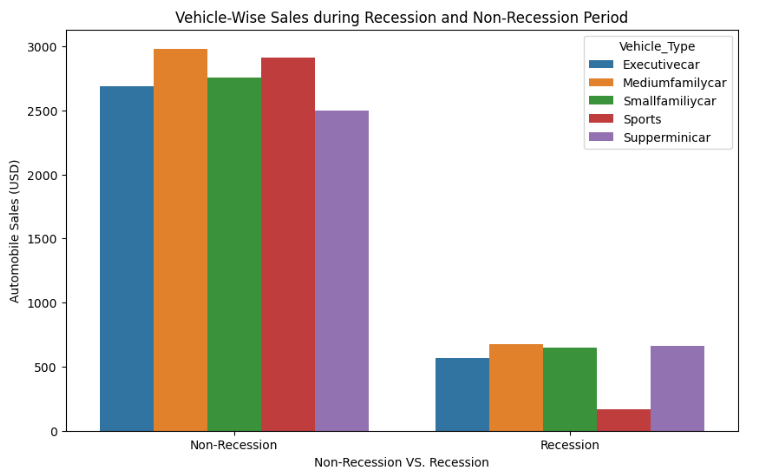
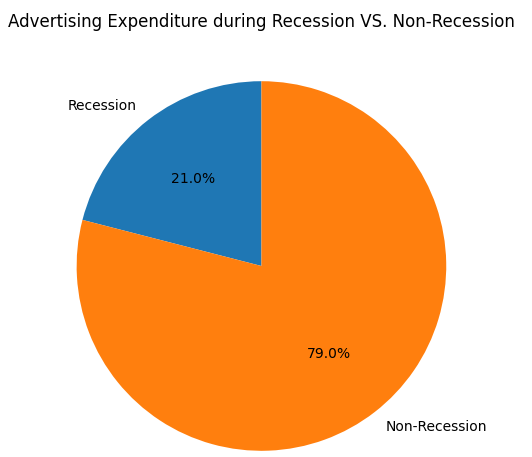
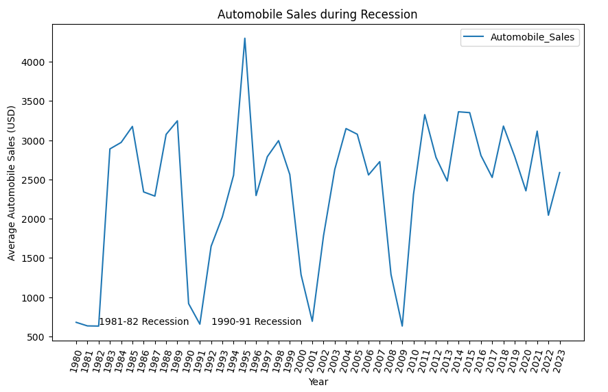
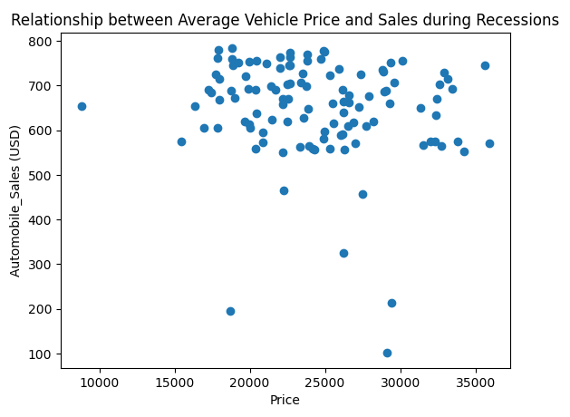
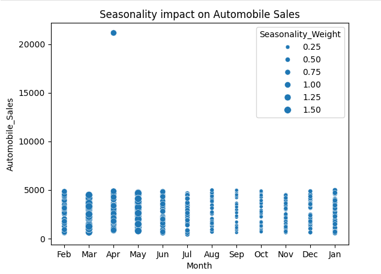

# Data Visualization with Python

## Project Overview

In this project, I utilized Python and various libraries to create a range of data visualizations. The goal was to explore and present data through different visualization types, including column charts, bar charts, pie charts, and more. This project provided hands-on experience with Python's powerful visualization libraries.

## Visualizations Created

- **Column Charts**: Used to display and compare data across different categories.
- **Bar Charts**: Illustrated data distributions and comparisons among discrete categories.
- **Pie Charts**: Showed proportions and percentages of different components within a whole.
- **Line Charts**: Analyzed trends and changes over time.
- **Scatter Plots**: Examined relationships and correlations between two variables.

## Libraries Used

- **Matplotlib**: For creating static, animated, and interactive visualizations.
- **Seaborn**: Built on Matplotlib, used for making statistical graphics.
- **Plotly**: Enabled interactive and web-based visualizations.
- **Pandas**: Facilitated data manipulation and preparation for visualization.

## Key Learnings

- **Python Libraries**: Gained proficiency in using Python libraries such as Matplotlib, Seaborn, and Plotly for creating various types of charts and visualizations.
- **Data Visualization Techniques**: Learned how to effectively represent data through different visualization methods to convey insights and patterns.
- **Hands-On Experience**: Developed practical skills in data preparation, visualization design, and analysis.

## Project Examples

### Bar Chart

### Pie Chart

### Line Chart

### Scatter Plot

### Bubble Graph

## Conclusion

This project enhanced my understanding of data visualization techniques and Python libraries. I now have the ability to create informative and visually appealing charts that help in analyzing and presenting data effectively.
